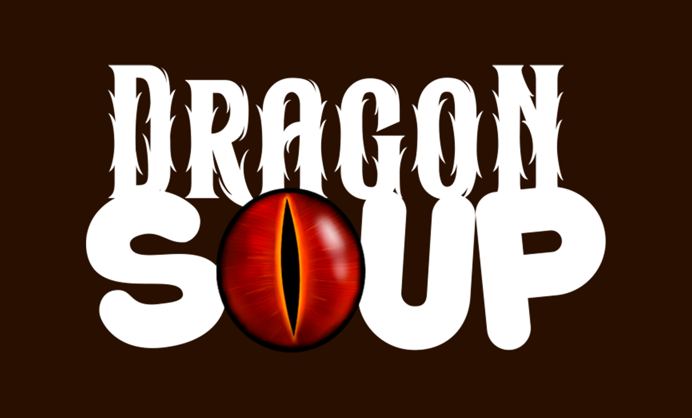
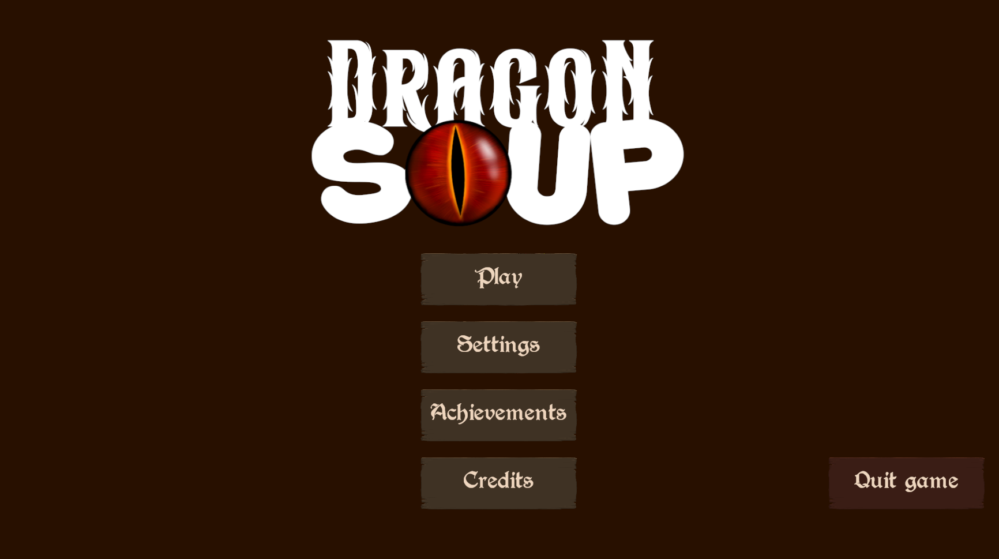
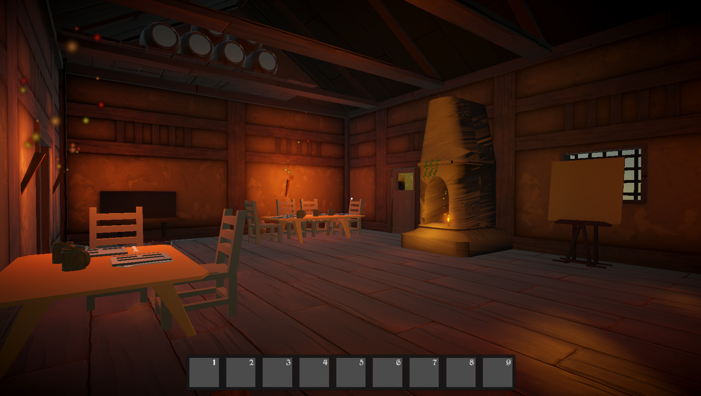
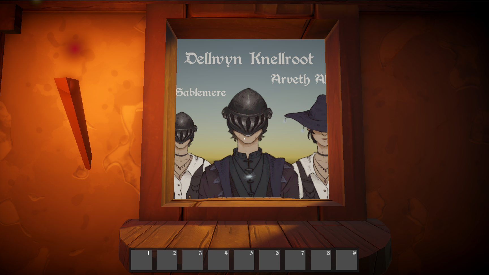
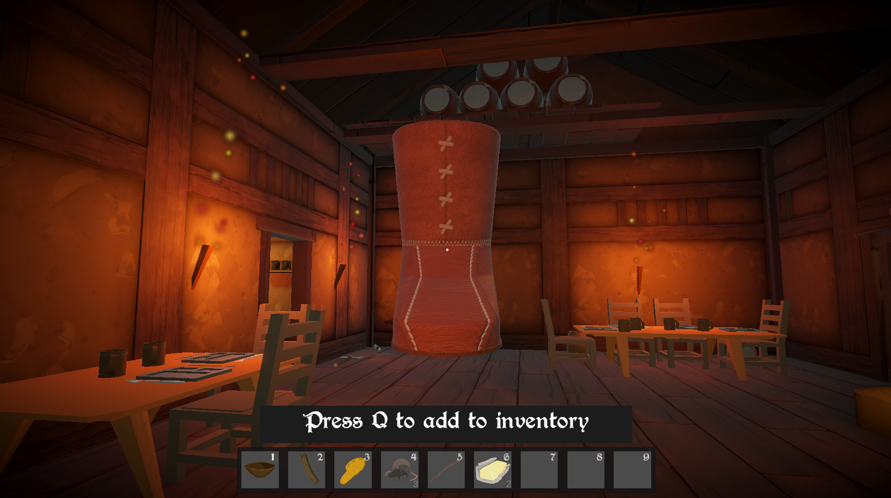
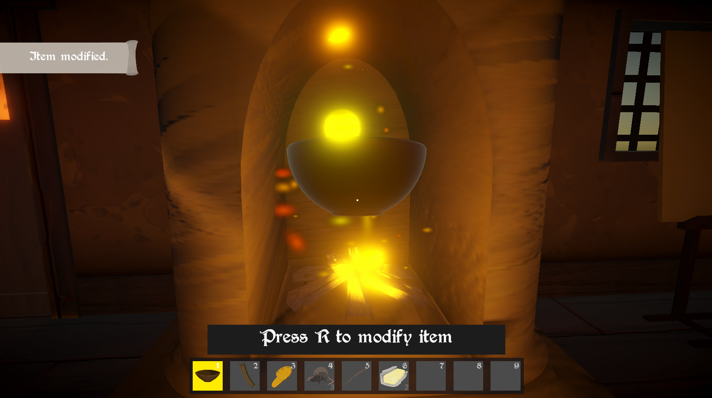
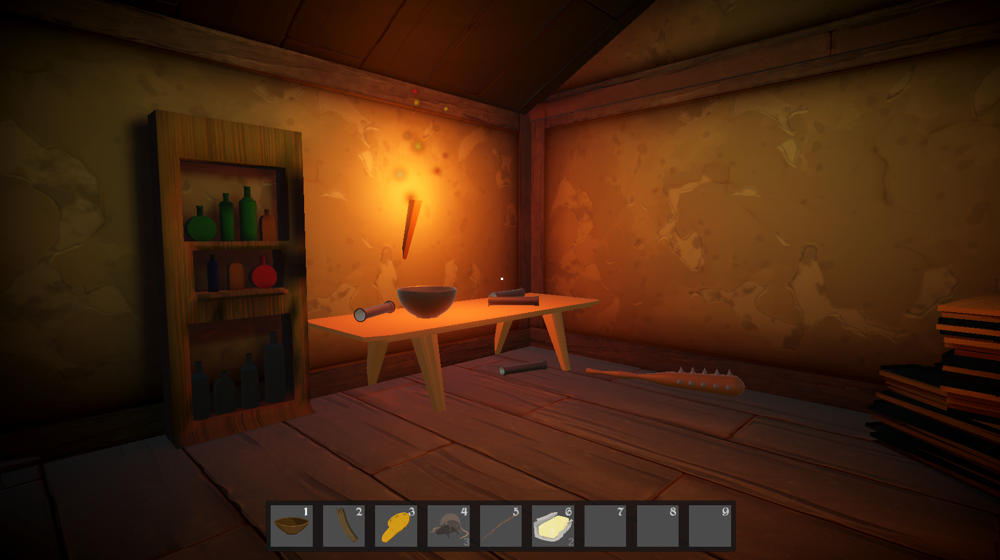
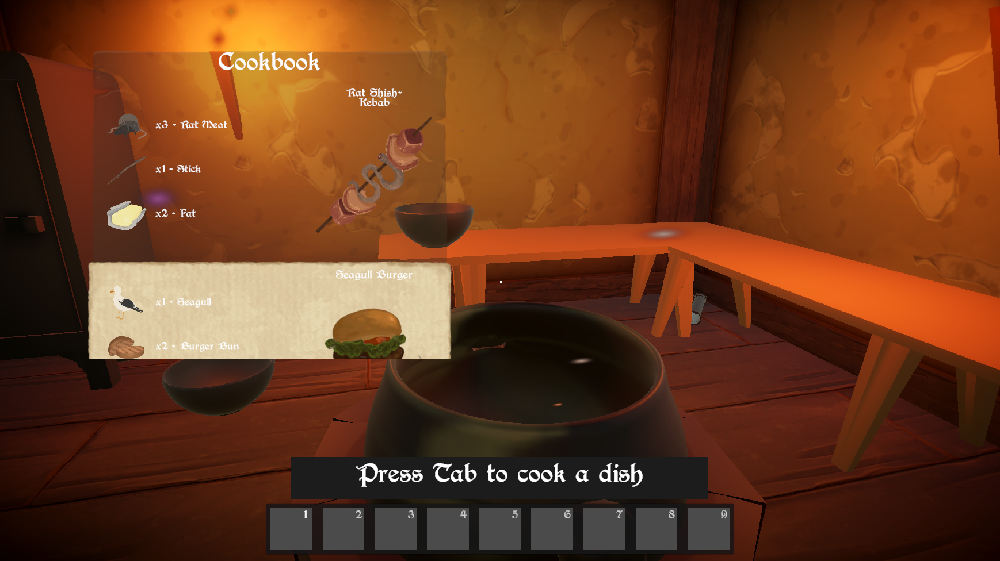

### A narrative puzzle simulation game where you play as the tavern keeper, not the hero.

---

## About the Game

**Dragon Soup** is a first-person fantasy tavern game that changes the usual role of the player in MMORPGs.

Normally, the player is an adventurer who talks to NPCs, accepts quests, and receives rewards. In **Dragon Soup**, the player takes the role of one of these NPCs — a tavern keeper. Adventurers come to the tavern with their own requests and problems. The player must talk to them, understand what they need, prepare quests and rewards, and help them continue their journey.

The main idea of the game is to show the familiar MMORPG quest system from the other side — from the perspective of the NPC.

---

## Gameplay Trailer

<a href="https://youtu.be/Md8u-3zo31Y?si=y4kyKYZ12CvHMw2M">
  <strong>▶ Watch the Gameplay Trailer</strong>
</a>

The main gameplay loop is:

1. Talk to adventurers who visit the tavern
2. Learn what they need and give them quests
3. Prepare suitable rewards for completed quests
4. Collect ingredients and cook new recipes
5. Upgrade or dismantle items to satisfy adventurers’ requests
6. Use the Dark Entity to skip a recipe and receive all required ingredients
7. Continue the story and reach one of the endings

---

## Key Features

<table>
<tr>
<td width="50%" valign="top">

### Adventurers and Quests

Adventurers visit the tavern with different needs and requests. The player talks to them, gives them quests, and prepares rewards for their return.

</td>
<td width="50%" valign="top">

### Cooking and Recipes

The player collects ingredients and cooks different recipes. Prepared dishes are used to continue the progression and story.

</td>
</tr>
<tr>
<td width="50%" valign="top">

### Rewards and Item Management

Items can be collected, carried, stored, and used as rewards. Choosing the correct item is important for satisfying each adventurer’s request.

</td>
<td width="50%" valign="top">

### Upgrading and Dismantling

Some adventurers ask for upgraded items or separate furniture parts. The player can improve items at upgrade stations or dismantle furniture into reusable components.

</td>
</tr>
<tr>
<td width="50%" valign="top">

### Dark Entity

The Dark Entity offers an optional shortcut. The player can skip the normal recipe process and receive all ingredients required for the current recipe.

</td>
<td width="50%" valign="top">

### Story Progression and Endings

Completing quests, preparing rewards, and using the tavern systems moves the story forward. The player’s actions eventually lead to one of the available endings.

</td>
</tr>
</table>

---

## Screenshots

---
## Technology

- **Engine:** Unity
- **Language:** C#
- **Audio:** Wwise
- **3d Modeling:** Blender
- **Textures creation:** Substance painter
- **2d Art:** Procreate
- **Data architecture:** ScriptableObjects for items, ingredients, recipes, adventurers and so on
- **Dialogue:** JSON-based dialogue system
- **System communication:** C# events
- **Reusable content:** Unity Prefabs for all items, characters, stations, and UI elements
- **Saving:** Custom save and load system

---

## Notable Systems

- Adventurer spawning and interaction
- Quest and reward system
- JSON-based dialogue
- Dice-based haggling
- Cooking and recipe system
- Nine-slot hotbar
- Item pickup, carrying, and placement
- Upgrade stations
- Furniture dismantling
- Dark Entity interactions
- Game recipe progression
- Save and load system
- Main menu, settings, and gameplay UI
- Notifications, cutscenes, and interaction feedback

---

## Team

| Team Member | Role | Main Responsibilities |
|---|---|---|
| **Taha Batur Şenli** | Game Designer & Project Manager | Game concept, gameplay design and narrative content |
| **Roman Shostak** | Unity Developer | Dialogue and quest systems, haggling, item upgrading and dismantling, and the Dark Entity system |
| **Iryna Huryn** | Unity Developer | Cooking system фтв progression, hotbar and item interactions, menu implementation, and save/load system |
| **Nazree Nadhir** | 3D Artist | Furniture, rewards, ingredients and finished dishes |
| **Lisa Grebe** | 2D & 3D Artist | House model, UI, icons, and other 2D assets |
| **Jonathan Glück** | Sound Designer & Audio Engineer | Music, sound effects, audio implementation, and mixing |

---

## Links

- **Playable build:** Coming later
- **Gameplay video:** [Link](https://youtu.be/Md8u-3zo31Y?si=y4kyKYZ12CvHMw2M)

---

## Credits

Created as a university team project by students from different specializations, including game design, Unity development, hardware development, and art.

Special thanks to everyone who contributed to the prototype, testing, presentation, and final delivery.

---

## Third-Party Assets

Dragon Soup uses some of third-party assets. These materials remain the property of their respective authors and are used according to their original licenses.

| Asset | Author / Source | License | Usage |
|---|---|---|---|
| **[Berry Rotunda](https://www.dafont.com/berry-rotunda.font)** | Typo-Graf / DaFont | Public Domain | Used for menus, dialogue panels, notifications, and other UI text |
| **[Tudor Wall 03](https://freestylized.com/material/tudor-wall-03/)** | FreeStylized | FreeStylized Custom CC0 / Royalty-Free License | Used for the tavern wall material |
| **[Wood Planks 05](https://freestylized.com/material/wood_planks_05/)** | FreeStylized | FreeStylized Custom CC0 / Royalty-Free License | Used for the tavern floor material |

Unless otherwise noted, the original code, artwork, game design materials, and hardware-related content were created by the Dragon Soup development team.

---

## License

Copyright © 2026 Dragon Soup Team. All rights reserved.

This project is publicly available for portfolio viewing and educational evaluation only. The source code, original assets, hardware materials, and other project contents may not be copied, modified, redistributed, or used in other projects without prior written permission from the respective copyright holders.

Third-party assets are excluded from this license and remain subject to their respective licenses and terms of use.

---
